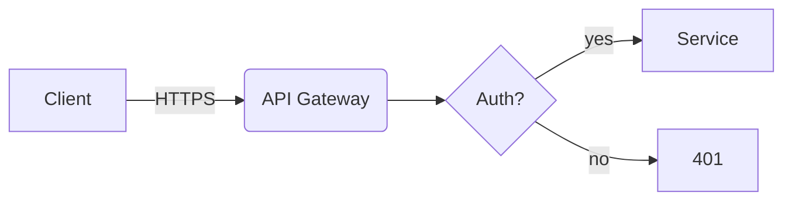

# Publish a post to Tuan Tran's portfolio

Insert a row into `public.posts`. The React app fetches and renders it immediately — no build, no deploy step.

> **Stack already installed in this project**: `react-markdown` + `remark-gfm` + `remark-math` + `rehype-katex` + `react-syntax-highlighter` + `mermaid`. The renderer lives at `src/components/Markdown.jsx`. Don't reinstall.

## When to use

User says any of:
- "viết bài về …" / "write a post about …"
- "publish bài này" / "đăng cái này lên"
- "ghi blog / nhật ký / coding note"
- Or shares notes and asks them to be turned into a post.

## API — insert a post

### Endpoint

```
POST https://fuipokwzlcysrtagoinl.supabase.co/rest/v1/posts
```

### Headers

```
apikey:        <VITE_SUPABASE_PUBLISHABLE_KEY>
Authorization: Bearer <VITE_SUPABASE_PUBLISHABLE_KEY>
Content-Type:  application/json
Prefer:        return=representation
```

Key lives in `.env.local`. If INSERT is blocked by RLS, fall back to psql with the project owner's DB password or the Supabase Dashboard SQL editor.

### Body

```json
{
  "slug": "kebab-case-unique-slug",
  "category": "coding",
  "title": "Post title",
  "excerpt": "Optional one-line summary",
  "body": "Markdown content...",
  "date_label": "2026",
  "published": true
}
```

| Field        | Required | Notes                                              |
|--------------|----------|----------------------------------------------------|
| `slug`       | yes      | unique, kebab-case ASCII, no diacritics            |
| `category`   | yes      | one of: `coding`, `libraries`, `infra`, `journal`  |
| `title`      | yes      | plain text                                         |
| `body`       | yes      | markdown — see "Markdown features" below           |
| `excerpt`    | no       | one-line summary                                   |
| `date_label` | no       | display override, e.g. `"Aug 2024"`. If null, UI shows formatted `created_at` |
| `published`  | no       | default `true`                                     |

### Category guide

| category    | When to use                                                      |
|-------------|------------------------------------------------------------------|
| `coding`    | Technical write-ups: bugs, fixes, language/framework deep-dives  |
| `libraries` | Reviewing or introducing a library / tool                        |
| `infra`     | Architecture, deployment, CI/CD, devops, observability           |
| `journal`   | Personal experiences, reflections, hackathon recaps              |

### Example — curl

```bash
curl -X POST "https://fuipokwzlcysrtagoinl.supabase.co/rest/v1/posts" \
  -H "apikey: $VITE_SUPABASE_PUBLISHABLE_KEY" \
  -H "Authorization: Bearer $VITE_SUPABASE_PUBLISHABLE_KEY" \
  -H "Content-Type: application/json" \
  -H "Prefer: return=representation" \
  -d '{
    "slug": "rust-tauri-window-tricks",
    "category": "coding",
    "title": "Rust + Tauri window tricks",
    "body": "..."
  }'
```

### Example — psql (preferred when body has lots of quotes)

```bash
PGPASSWORD='<user-supplies>' psql \
  -h db.fuipokwzlcysrtagoinl.supabase.co -p 5432 -U postgres -d postgres <<'SQL'
insert into public.posts (slug, category, title, body, date_label) values (
  'rust-tauri-window-tricks',
  'coding',
  'Rust + Tauri window tricks',
  $$<markdown body — dollar-quoted so backticks/quotes inside don't escape>$$,
  '2026'
);
SQL
```

## Markdown features the renderer supports

The renderer at `src/components/Markdown.jsx` uses **react-markdown + GFM + math + KaTeX + Prism + Mermaid**. All of this works:

### Text

- Paragraphs (blank line between)
- **bold**, *italic*, ~~strikethrough~~
- Links: `[text](https://…)` — external links auto-open in new tab
- Inline code: `` `like this` ``
- Headings: `## H2`, `### H3` (avoid `#` H1 — title is rendered separately)
- Lists (ordered and unordered)
- Blockquotes (`> …`)
- Tables (GFM pipe syntax)

### Code blocks (syntax-highlighted with Prism / oneDark)

````
```python
def hello():
    return "world"
```
````

Supported languages: any Prism language tag (`python`, `js`, `ts`, `tsx`, `rust`, `go`, `bash`, `sql`, `json`, `yaml`, `css`, `html`, …).

### LaTeX (KaTeX)

Inline: `$E = mc^2$` → renders inline.

Block:

```
$$
\int_{0}^{\infty} e^{-x^2}\,dx = \frac{\sqrt{\pi}}{2}
$$
```

### Mermaid diagrams & charts

Use a `mermaid` code block:

````

````

Mermaid handles flowcharts, sequence, class, state, ER, gantt, pie charts, mindmaps, timeline, and `xychart-beta` for line/bar charts. The renderer re-themes diagrams when the user toggles dark mode.

### Images

```

```

Images get lazy-loaded, rounded corners, and a thin border automatically.

## Hosting images — Supabase Storage

Bucket: **`post-images`** (already created, public read).

- **Max file size:** 5 MB per image
- **Allowed MIME types:** `image/png`, `image/jpeg`, `image/gif`, `image/webp`, `image/svg+xml`

### Public URL pattern

```
https://fuipokwzlcysrtagoinl.supabase.co/storage/v1/object/public/post-images/<path>
```

Suggested path convention: `posts/<year>/<slug>/<filename>.png` so files stay organized.

### Upload — Supabase Dashboard

1. Supabase → Storage → `post-images` → Upload file (or create folder first).
2. Click the file, copy "Public URL".
3. Paste into the markdown body as ``.

This is the simplest path; recommend it to the user unless they specifically want CLI/API upload.

### Upload — REST API (only if INSERT policy allows it)

The default storage RLS is "public read only." To enable API uploads with the publishable key, the user must add an INSERT policy on `storage.objects` for `bucket_id = 'post-images'`. Until then, the publishable key cannot upload.

If they enable it:

```bash
curl -X POST \
  "https://fuipokwzlcysrtagoinl.supabase.co/storage/v1/object/post-images/posts/2026/<slug>/cover.png" \
  -H "apikey: $VITE_SUPABASE_PUBLISHABLE_KEY" \
  -H "Authorization: Bearer $VITE_SUPABASE_PUBLISHABLE_KEY" \
  -H "Content-Type: image/png" \
  --data-binary "@./local-file.png"
```

Returns the storage object key; build the public URL with the pattern above.

### Free alternatives (if you don't want Supabase Storage)

| Host             | URL pattern                                            | Notes                                   |
|------------------|--------------------------------------------------------|------------------------------------------|
| GitHub (repo)    | `https://raw.githubusercontent.com/<u>/<r>/<branch>/<path>` | Free, versioned, cache-friendly      |
| Cloudinary       | `https://res.cloudinary.com/<cloud>/image/upload/<path>` | Free tier, automatic optimization      |
| Imgur            | `https://i.imgur.com/<id>.png`                         | Free, anonymous upload via API           |
| ImgBB            | `https://i.ibb.co/<id>/<name>.png`                     | Free, has API                            |

Supabase Storage is preferred because it's already integrated with auth/RLS and lives next to the post data.

## Workflow — from draft to live

### 1. Confirm with the user (only if unclear)

- Category (`coding` / `libraries` / `infra` / `journal`)
- Title and slug
- Whether to include images, code, math, diagrams

### 2. Draft the body

Write in markdown. Use the features above. Keep paragraphs tight — the site uses a narrow reading column.

**Style guidance for *Tuan's* posts:**
- Concrete and specific over abstract ("Cut latency from 4.5s to 2.2s" beats "improved performance").
- First-person, low ceremony, no marketing copy.
- Lead with the problem; end with the takeaway.
- Code blocks short and self-contained.
- For `journal`: it's OK to be personal and informal. "Things I went through" — story-shaped, not how-to-shaped.

### 3. If the post uses images

For each image:
1. Upload to Supabase Storage `post-images` bucket (path `posts/<year>/<slug>/<file>.png`)
2. Build public URL with the pattern above
3. Reference in markdown as ``

### 4. Insert the post

Use the REST API or psql example from "API — insert a post" above.

### 5. Verify before reporting done

```bash
curl -s "https://fuipokwzlcysrtagoinl.supabase.co/rest/v1/posts?slug=eq.<slug>&select=slug,title,category,date_label" \
  -H "apikey: $VITE_SUPABASE_PUBLISHABLE_KEY" \
  -H "Authorization: Bearer $VITE_SUPABASE_PUBLISHABLE_KEY"
```

Expect a one-element JSON array. Empty → row not visible (RLS, wrong slug, or `published=false`).

Then tell the user to refresh; the post shows up in:
- Home → "Recent writing" (top 6)
- Blog → all categories
- Blog → `<category>` → filtered list

### 6. Editing or unpublishing

```sql
update public.posts
   set body = $$...new markdown...$$, updated_at = now()
 where slug = 'rust-tauri-window-tricks';

update public.posts set published = false where slug = '…';
delete from public.posts where slug = '…';
```

## Common pitfalls

1. **Slug collisions** — `posts.slug` is unique; pick a different one if insert fails.
2. **Category typos** — only the four enum values are valid; others rejected by check constraint.
3. **Mermaid syntax errors** — render shows a red error block. Test the diagram on [mermaid.live](https://mermaid.live) first.
4. **Image too large or wrong MIME** — bucket rejects files > 5MB or non-image MIME. Compress / convert first.
5. **KaTeX errors** — `$…$` requires balanced delimiters. Escaping a literal `$` in prose: write `\$`.
6. **Forgetting `published`** — defaults to true, but if explicitly set false, anon key can't see it.

## Env vars expected by the frontend

In `.env.local` (gitignored):

```
VITE_SUPABASE_URL=https://fuipokwzlcysrtagoinl.supabase.co
VITE_SUPABASE_PUBLISHABLE_KEY=sb_publishable_...
```

These are loaded by `src/lib/supabase.js` at app startup.
