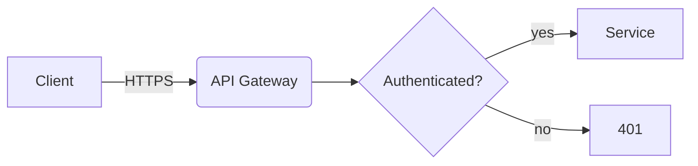
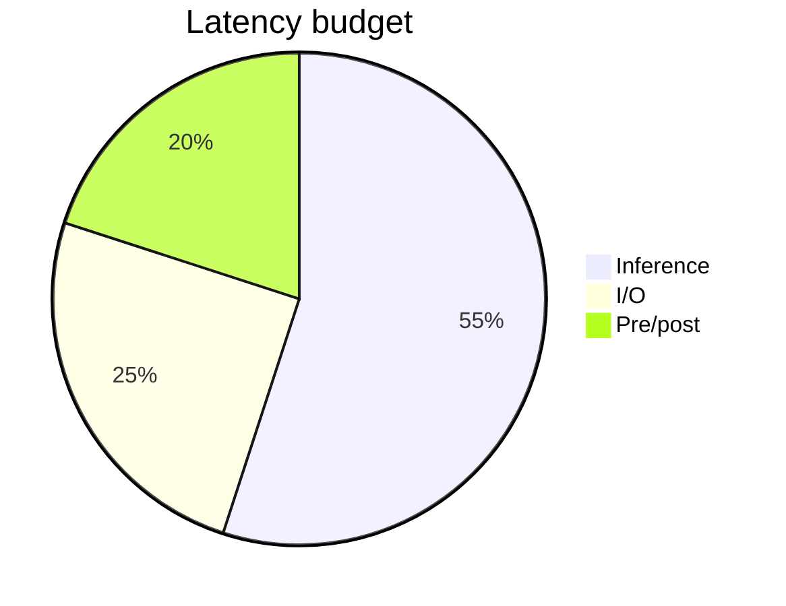
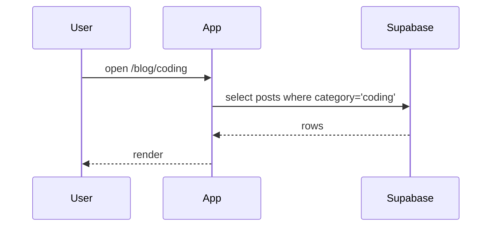

# Publish a post to Tuan Tran's portfolio

The site lives at **https://adib-clone.vercel.app** and reads posts from Supabase at runtime. Inserting a row into `public.posts` publishes it instantly — no build, no redeploy.

> **Already installed**: `react-markdown` + `remark-gfm` + `remark-math` + `rehype-katex` + `react-syntax-highlighter` + `mermaid` + `katex` CSS. Renderer at `src/components/Markdown.jsx`. **Do not reinstall.**

## When to use this skill

User says any of:
- "viết bài về X" / "write a post about X"
- "publish bài này" / "đăng cái này lên"
- "ghi blog / nhật ký / coding note"
- Hands you raw notes and asks you to turn them into a post.

If the user already has a draft, your job is mostly: pick category + slug, upload any images, format the markdown, insert via REST.

---

## 1) Insert a post — REST API

### Endpoint

```
POST https://fuipokwzlcysrtagoinl.supabase.co/rest/v1/posts
```

### Headers

```
apikey:        $VITE_SUPABASE_PUBLISHABLE_KEY
Authorization: Bearer $VITE_SUPABASE_PUBLISHABLE_KEY
Content-Type:  application/json
Prefer:        return=representation
```

The publishable key is in the project's `.env.local`. Frontend already uses it. RLS allows public INSERT on `posts` — no auth needed.

### Body

| Field         | Required | Type    | Notes                                                                 |
|---------------|----------|---------|-----------------------------------------------------------------------|
| `slug`        | yes      | text    | unique, kebab-case ASCII, no diacritics, 3–6 words                    |
| `category`    | yes      | enum    | `coding` \| `libraries` \| `infra` \| `journal`                       |
| `title`       | yes      | text    | plain text                                                            |
| `body`        | yes      | text    | markdown — see §3                                                     |
| `excerpt`     | no       | text    | one-line summary                                                      |
| `date_label`  | no       | text    | UI override, e.g. `"Aug 2024"`. If null, UI shows formatted `created_at` |
| `published`   | no       | bool    | default `true`                                                        |

### Category guide

| category    | Use for                                                                |
|-------------|------------------------------------------------------------------------|
| `coding`    | Technical write-ups: bugs, fixes, language / framework deep-dives      |
| `libraries` | Introducing or reviewing a library / tool                              |
| `infra`     | Architecture, deployment, CI/CD, devops, observability                 |
| `journal`   | Personal experiences, reflections, hackathon recaps — "things I went through" |

### Slug rules

- kebab-case, ASCII only, no diacritics ("hoc-rust" not "học-rust")
- 3–6 words, ≤ 60 chars
- Must be unique. If insert fails with `duplicate key`, append a discriminator (`-v2`, `-pt2`, etc.)

### Insert — curl example

```bash
curl -X POST "https://fuipokwzlcysrtagoinl.supabase.co/rest/v1/posts" \
  -H "apikey: $VITE_SUPABASE_PUBLISHABLE_KEY" \
  -H "Authorization: Bearer $VITE_SUPABASE_PUBLISHABLE_KEY" \
  -H "Content-Type: application/json" \
  -H "Prefer: return=representation" \
  -d '{
    "slug": "rust-tauri-window-tricks",
    "category": "coding",
    "title": "Rust + Tauri window tricks",
    "excerpt": "Three things I wish I knew before shipping iShot.",
    "body": "Markdown body here. Use \\n for newlines in JSON.",
    "date_label": "2026"
  }'
```

### Insert — psql (preferred for long bodies with quotes/backticks)

```bash
PGPASSWORD='<ask user>' psql \
  -h db.fuipokwzlcysrtagoinl.supabase.co -p 5432 -U postgres -d postgres <<'SQL'
insert into public.posts (slug, category, title, excerpt, body, date_label) values (
  'rust-tauri-window-tricks',
  'coding',
  'Rust + Tauri window tricks',
  'Three things I wish I knew before shipping iShot.',
  $$
Two-sentence hook.

## What I learned

Paragraph with `inline code` and a code block:

```rust
fn main() { println!("hello"); }
```
  $$,
  '2026'
);
SQL
```

`$$ … $$` dollar-quoting means you can paste markdown verbatim — no escaping backticks or quotes.

### Verify before saying "done"

```bash
curl -s "https://fuipokwzlcysrtagoinl.supabase.co/rest/v1/posts?slug=eq.<slug>&select=slug,title,category,date_label,published" \
  -H "apikey: $VITE_SUPABASE_PUBLISHABLE_KEY" \
  -H "Authorization: Bearer $VITE_SUPABASE_PUBLISHABLE_KEY"
```

Expect a one-element JSON array. Empty → row not visible (RLS, wrong slug, or `published=false`).

Then tell the user to refresh. The post appears in:
- **Home** → "Recent writing" (top 6, across all categories)
- **Blog** (parent) → all posts
- **Blog → \<category\>** → filtered

### Edit / unpublish / delete

```sql
update public.posts set body = $$...new markdown...$$, updated_at = now()
 where slug = '<slug>';

update public.posts set published = false where slug = '<slug>';   -- hide
delete from public.posts where slug = '<slug>';                    -- remove
```

---

## 2) Images — three ways to host them

The site renders any standard markdown image:

```

```

The renderer adds lazy-loading, rounded corners, and a thin border automatically. Make `alt` descriptive — it's both accessibility and a fallback if the URL ever 404s.

### Path A — Supabase Storage (RECOMMENDED; lives next to the post data)

**Bucket already exists**: `post-images` — public read, 5 MB / file, image MIMEs only.

#### A1. Upload via Supabase Dashboard (simplest, 30 seconds)

1. Open https://supabase.com/dashboard/project/fuipokwzlcysrtagoinl/storage/buckets/post-images
2. Click **"Upload file"** (or create a folder first using **"Create folder"**).
3. Recommended folder layout: `posts/<year>/<slug>/<filename>`
   Example: `posts/2026/rust-tauri-window-tricks/cover.png`
4. After upload, click the file → **"Copy URL"** → use it as the image src.

Public URL pattern:

```
https://fuipokwzlcysrtagoinl.supabase.co/storage/v1/object/public/post-images/posts/2026/rust-tauri-window-tricks/cover.png
```

#### A2. Upload via REST API (programmatic, needs service-role key)

The **publishable** key can **only read**, not upload. To upload via API you need the **service-role** key (ask the user; it lives in Supabase Dashboard → Project Settings → API → `service_role` secret — **never commit, never expose in frontend**).

```bash
SR="<service-role-key>"   # never log or echo this
curl -X POST \
  "https://fuipokwzlcysrtagoinl.supabase.co/storage/v1/object/post-images/posts/2026/<slug>/cover.png" \
  -H "apikey: $SR" \
  -H "Authorization: Bearer $SR" \
  -H "Content-Type: image/png" \
  --data-binary "@./cover.png"
```

On success, the public URL is `https://fuipokwzlcysrtagoinl.supabase.co/storage/v1/object/public/post-images/posts/2026/<slug>/cover.png`.

#### A3. Upload via Supabase CLI (if installed)

```bash
supabase storage cp ./cover.png ss://post-images/posts/2026/<slug>/cover.png
```

Returns the storage object key; build the public URL with the pattern above.

### Path B — Free alternatives (no Supabase Storage needed)

Use any of these when the user prefers not to touch Supabase Storage:

| Host        | Public URL pattern                                                       | Pros / cons                                                  |
|-------------|--------------------------------------------------------------------------|--------------------------------------------------------------|
| **GitHub (raw)** | `https://raw.githubusercontent.com/<user>/<repo>/<branch>/<path>`  | Free, versioned, CDN-cached. Need a public repo.             |
| **Cloudinary**   | `https://res.cloudinary.com/<cloud>/image/upload/<path>`           | Free tier, auto optimization, on-the-fly resize via URL.     |
| **Imgur**        | `https://i.imgur.com/<id>.png`                                     | Free anon upload via API. Posts may be aged-out for inactivity. |
| **ImgBB**        | `https://i.ibb.co/<id>/<name>.png`                                 | Free, simple API with a key.                                 |
| **Vercel Blob**  | `https://<id>.public.blob.vercel-storage.com/<path>`               | If user already uses Vercel; requires a token.               |

For a post that needs to look good for years, prefer **Supabase Storage** or **GitHub raw** (under the user's own repo, so it can't disappear).

### Path C — Inline screenshots only? Use a data URL

For tiny diagrams / one-off screenshots you don't want to host:

```

```

Not recommended for anything larger than ~10 KB — it bloats the post row.

### Image sizing & format tips

- **Max width that the renderer shows**: about 700 px (content column max-width). Bigger images downscale automatically but waste bandwidth.
- **Optimal upload size**: 1400 px wide @ 80% JPEG quality, or PNG for screenshots with text.
- **For screenshots with UI text**: PNG keeps text crisp; JPEG smears it.
- **For photos**: WebP or JPEG.
- **GIFs / video**: avoid GIF; convert to WebP animation or MP4 (currently the renderer doesn't handle `<video>` — link out instead).
- **SVG**: works (`image/svg+xml` is in the allowed MIME list), but sanitize untrusted SVGs to strip scripts.
- **Naming**: lowercase, kebab-case, descriptive — `vim-jump-list.png`, not `Screenshot 2026-05-12.png`.

### Image alt text — a quick rule

`` is better than ``. Describe what's *in* it.

---

## 3) Markdown features the renderer supports

All standard GitHub-flavored markdown plus math and diagrams. Test anything unusual in a draft post first if uncertain.

### Text

- Paragraphs (blank line between blocks)
- `**bold**`, `*italic*`, `~~strikethrough~~`
- `[link text](https://…)` — external links open in a new tab automatically
- `` `inline code` ``
- Headings: `## H2`, `### H3`. **Avoid `# H1`** — the page title is rendered separately.
- Lists: `- item` (unordered) and `1. item` (ordered)
- Blockquotes: `> Quoted text`
- Tables (GFM pipe syntax):

  ```
  | Col A | Col B |
  | ----- | ----- |
  | foo   | bar   |
  ```

### Code blocks — syntax highlighted

Fence with three backticks and a language tag:

````
```python
def hello():
    return "world"
```
````

Any Prism-supported language works: `python`, `js`, `ts`, `tsx`, `rust`, `go`, `bash`, `sql`, `json`, `yaml`, `css`, `html`, `dockerfile`, `nginx`, `toml`, `lua`, `c`, `cpp`, `csharp`, `java`, `kotlin`, `swift`, …

Omit the language for plain monospace blocks.

### LaTeX (KaTeX)

Inline: `The cost is $O(n \log n)$.`

Block:

```
$$
\int_{0}^{\infty} e^{-x^2}\,dx = \frac{\sqrt{\pi}}{2}
$$
```

Escape a literal `$` in prose: `\$`. Malformed LaTeX renders as red error text — test complex expressions on [katex.org](https://katex.org).

### Mermaid diagrams & charts

Use a `mermaid` code block. Mermaid handles flowcharts, sequence diagrams, class/state/ER diagrams, gantt, pie charts, mindmaps, timeline, and `xychart-beta` for line/bar charts.

````

````

Pie chart:

````

````

Sequence:

````

````

Diagrams retheme automatically when the user toggles dark mode. Test syntax at [mermaid.live](https://mermaid.live) first — a syntax error in a diagram renders as a red error block.

### Images (covered in §2)

```

```

### Things the renderer does NOT handle

- HTML embedded in markdown (sanitized away) — use markdown primitives instead
- `<video>` tags — link out to a hosted video instead
- Footnotes (despite GFM support, the renderer doesn't style them — avoid)
- Custom React components in markdown — there's no MDX

---

## 4) Workflow checklist — start to finish

1. **Confirm intent** (only if unclear)
   - Category? (coding / libraries / infra / journal)
   - Title and slug?
   - Any images, code blocks, math, diagrams?

2. **Draft the body** in markdown using §3 features. Match the user's voice:
   - Concrete over abstract ("Cut latency from 4.5s to 2.2s" beats "improved performance")
   - First-person, low ceremony
   - Lead with the problem, end with the takeaway
   - Code blocks should be short and self-contained
   - For `journal`: it's OK to be informal and personal — story-shaped, not how-to-shaped

3. **Upload any images** following §2. Get the public URLs. Embed with ``.

4. **Insert** via the REST or psql example in §1.

5. **Verify** with the curl in §1. Then tell the user to refresh.

---

## 5) Pitfalls

1. **Slug collisions** — `posts.slug` is unique. On collision, append a discriminator.
2. **Category typos** — only the four enum values pass the check constraint. Others get rejected.
3. **Image too large** — bucket rejects > 5 MB. Compress / convert first.
4. **Wrong image MIME** — only `image/png|jpeg|gif|webp|svg+xml` accepted by `post-images` bucket.
5. **Mermaid syntax errors** — show as red error blocks. Test at mermaid.live first.
6. **KaTeX errors** — unbalanced `$` delimiters break rendering. Escape literal `$` as `\$`.
7. **Forgetting `published`** — defaults to true. If explicitly false, anon key cannot read it.
8. **Trying to upload via the publishable key** — it can only read. Use Dashboard (manual) or service-role key (API).

---

## 6) Env reference

In the project's `.env.local` (gitignored):

```
VITE_SUPABASE_URL=https://fuipokwzlcysrtagoinl.supabase.co
VITE_SUPABASE_PUBLISHABLE_KEY=sb_publishable_...
```

Loaded by `src/lib/supabase.js` at runtime.

For service-role upload (API path A2), the key lives in Supabase Dashboard → Project Settings → API → `service_role`. **Never** put it in `.env.local`, never commit it, never log it.
